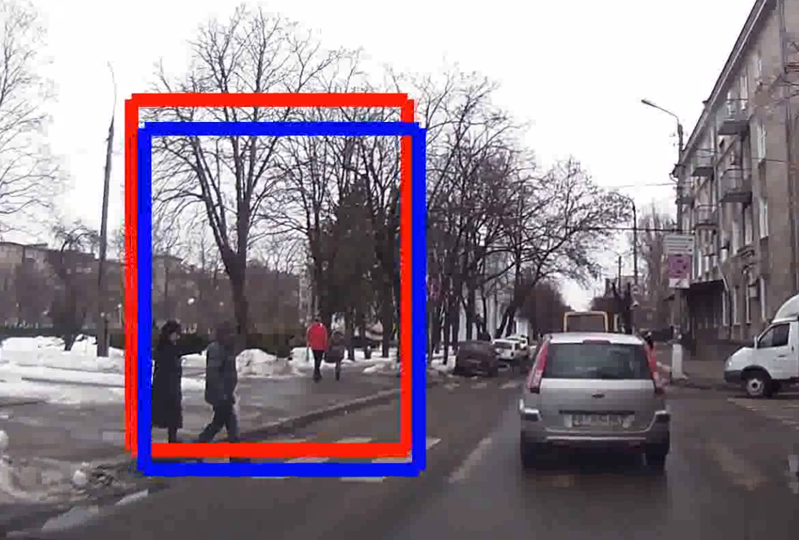

# Automatyczne rozpoznawanie pieszego wchodzącego na jezdnię
<!-- # Pedestrian Intention Prediction: A Multi-task Perspective -->

## _Absract_:
Przewidywanie działań pieszych było w ostatnich latach przedmiotem aktywnych badań, w wyniku którychpowstało wiele nowych rozwiązań algorytmicznych. W kontekście systemów wspomagania i autonomicznejjazdy zdolność przewidywania działań pieszych w szczególności podczas przechodzenia przez jezdnię jest uważana za ważną dla rozwoju autonomicznych pojazdów. W ciągu ostatniej dekady temat przewidywaniadziałań pieszych wzbudził duże zainteresowanie w społecznościach zajmujących się systemami wizyjnymii robotyką.  Zaproponowano wiele podejść, które dają obiecujące wyniki odnośnie przewidywania działań pieszych w pokonywaniu przejść dla pieszych.

## Introduction:
Do realizacji tego projektu wykorzystano metodę PV-LSTM przedstawioną w artykule ["Pedestrian Intention Prediction: A Multi-task Perspective"](https://arxiv.org/abs/2010.10270). Kod wykorzystany w tym projekcie pochodzi z (https://github.com/vita-epfl/bounding-box-prediction.git). Modyfikacji poddano:
- Zwizualizowano wyniki treningu sieci neuronowej.
- Wyniki testów sieci neuronowych zostały naniesione na ramki obrazów danej sceny.
- Wygenerowano film z sekwencji obrazów wraz z wynikami sieci.

## Architecture of PV-LSTM
Architektura wykorzystanej metody PV-LSTM, przedstawionej w artykule ["Pedestrian Intention Prediction: A Multi-task Perspective"](https://arxiv.org/abs/2010.10270).


## Results
--------------

  
## Installation:
------------
Start by cloning this repositiory:
```
git clone https://github.com/vita-epfl/bounding-box-prediction.git
cd bounding-box-prediction
```
Create a new conda environment (Python 3.7):
```
conda create -n pv-lstm python=3.7
conda activate pv-lstm
```
And install the dependencies:
```
pip install -r requirements.txt
```

## Dataset:
  
  * Clone the dataset's [repository](https://github.com/ykotseruba/JAAD).
  ```
  git clone https://github.com/ykotseruba/JAAD
  ```
  * Run the `prepare_data.py` script, make sure you provide the path to the JAAD repository and the train/val/test ratios (ratios must be in [0,1] and their sum should equal 1.
  ```
  python3 prepare_data.py |path/to/JAAD/repo| |train_ratio| |val_ratio| |test_ratio|
  ```
  * Download the [JAAD clips](http://data.nvision2.eecs.yorku.ca/JAAD_dataset/) (UNRESIZED) and unzip them in the `videos` folder.
  * Run the script `split_clips_to_frames.sh` to convert the JAAD videos into frames. Each frame will be placed in a folder under the `scene` folder. Note that this takes 169G of space.
  
  
## Training/Testing:
Open `train.py` and `test.py` and change the parameters in the args class depending on the paths of your files.
Start training the network by running the command:
```
python train.py
```
Test the trained network by running the command:
```
python test.py
```
Start generating bounding box from the file video_0332.csv:
```
python read.py
```
Generate movie from the video_0332 image:
```
python to_movie.py
```

## Tested Environments:
------------
  * Ubuntu 20.04, CUDA 11.2


### Citation

```
@inproceedings{bouhsain2020pedestrian,
title={Pedestrian Intention Prediction: A Multi-task Perspective},
 author={Bouhsain, Smail and Saadatnejad, Saeed and Alahi, Alexandre},
  booktitle = {European Association for Research in Transportation  (hEART)},
  year={2020},
}
```
